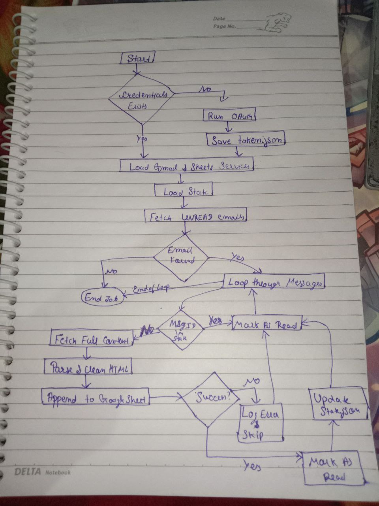

# Gmail to Google Sheet Automation

**Author:** Yuvraj Singh

---

## Project Overview

A python automation script that integrates with Gmail API and Google Sheets API to read unread emails from a Gmail inbox and marks them as read. It extracts the Sender, Subject, Date and Content and append to the sheet.

---

## High-Level Architecture



## Project Structure

```
gmail-to-sheets/
│
├── src/
│   ├── gmail_service.py     
│   ├── sheets_service.py   
│   ├── email_parser.py   
│   └── main.py         
│
├── credentials/
│   ├── credentials.json    
│   └── token.json                 
│
├── Video/
│   └──Yuvraj_Singh_assignment.mp4                 
| 
├── proof/
│   ├── 01_Unread_gmail_before.png
│   ├── 02_gmail_authentication.png
│   ├── 02_2_authentication.png
│   ├── 02_3_allow.png
│   ├── 02_4_oauth_finished.png
│   ├── 03_mainpy_logs.png>
│   ├── 04_sheet_after.png
│   ├── 05_Read_mails_after.png
│   ├── test_01.png
│   ├── test_02.png
│   └── high-level-diagram.png
│
├── .gitignore        
├── config.py             
├── requirements.txt    
├── README.md            
└── state.json             
```

<br>

# Setup Instructions

### 1. Prerequisites

* Python 3.8 or higher
* A Google Cloud Project with **Gmail API** and **Google Sheets API** enabled.


### 2. Installation

1. **Clone the repository:**

```
git clone https://github.com/uv-goswami/gmail-to-sheet
cd gmail-to-sheet
```


2. **Create and activate a virtual environment:**
```bash
python -m venv .venv
source .venv/bin/activate
```


3. **Install dependencies:**
```
pip install -r requirements.txt

```


4. **Google Cloud Configuration:**

   1. Go to [Google Cloud Console](https://console.cloud.google.com/)
   2. Create a new project: **"Gmail-Sheets-Automation"**
   3. Enable APIs:
      - Gmail API
      - Google Sheets API
   4. Create OAuth 2.0 Credentials:
      - Go to **Credentials -> Create Credentials -> OAuth Client ID**
      - Application type: **Desktop app**
      - Download `credentials.json`
   5. Place `credentials.json` in `credentials/` folder

   6. Create a new Google Sheet

   7. Create a `.env` file in the root directory:
   ```env
   SPREADSHEET_ID=your_spreadsheet_id_here
   SHEET_NAME=Sheet1
   ```


### 3. Running the Script

Run the main entry point:

```bash
python3 src/main.py
```

On the first run, a browser window will open asking you to log in and authorize the app.

<br>

## Design Decision & Logic
1. **OAuth 2.0 Authentication**
OAuth 2.0 is used to grant third-party applications limited access to users data hosted on a service provider(in our case Google Cloud) without requiring the user to share their passwords.I used `google-auth-oauthlib` library to handle OAuth flow. Because this is secure and simplifies the authentication and authorization process. It generates a 'token.json' after the first login, then it refreshes qutomatically for further runs.

2. **Duplicate Preventation**
To prevent duplicates I implemented two layers of protection.
   1. API only requests UNREAD emails. Since our script marks email as read after processing an Unread email. This method of only requesting UNREAD emails prevents duplication.
   2. I also implemented ID-based filterin. Every Gmail has a unique id. Before processing the script checks if the id exists in state.json. If yes then the email is skipped else the email is processed.

3. **State Persistence**
I chose a simple JSON file - state.json to store the ID of processed emails rather than a full database as JSON file is lightweight.This allows for O(1) time complexity regardless of how many emails are processed.

<br>

## Limitations

1. **Local State**: If state.json is deleted, the script relies on Unreead label. If you have old unread emails, they might be duplicated.

2. **Attachment Handling**: Currently the script ignores attachments and images only extracting text content. 

3. **Content truncation**: To keep the sheet readable the mail content is truncated to the first 500 characters.

4. **Rate Limiting**: The script fetches maximum of 50 emails per run to preserve API quotas.

<br>

## Challenges

1. **OAuth Token Expiration**: 
OAuth token expires every 1 hour. Running script after expiration causes authentication failure. Then I have to reauthenticate.

   **Solution**: I implemented automatic token refresh logic using `google.auth.transport.requests.Request` object to check for token expiration. If expired the script automatically uses refresh_token to request new Access Token from Google without requiring manual browser login from me.

2. **Secure Configuration**: 
Hardcoding sensitive data like SPREADSHEET_ID or file  paths into code is a major security risk and makes the code hard to deploy.

   **Solution**: I adopted the 12 Factor App principle for configuration
      * I used python-dotenv to load configuration variables.
      * I stored sensitive ID's into .env file
      * I added .env and credentials.json to .gitignore
      * I used os.path.join(Base_DIR, .....) to ensure the path works on any machine.

3. **Rate Limiting**: 
Google Cloud API has a quota for API. Fetching every single email in a large inbox one by one would hit limits quickly, causing the script with `429 Too Many Requests`.

   **Solution**: I implemented three stretigies:
      * In `gmail.service.py`, I used the `maxResults` parameter that is set to 50. This prevents the script from trying to pull all emails at once.
      * I implemented *State based filtering* by checking `state.json` before calling `get_email_details()` the script avoids redudant API calls.
      * The loop processes emails individually and saves the state immediately. If we hit rate limit(or loose network), the next run starts exactly where it left without refetching already finished emails. 

4. **Email with HTML**: 
Emails are often multipart (Text + HTML). Initially the parser would fail on emails that were HTML. 

   **Solution**: I implemented a recursive parsing strategy using `BeautifulSoup`.
      * The `EmailParser` class inspects the payload.
      * It prioritizes test/plain for accuracy.
      If text/plain is missing, it falls back to text/html, decodes the Base64 data and uses `BeautifulSoup` to strip tags and extract readable text.

## Proof of Execution

1. **Gmail inbox with unread emails**


2. **Gmail Authentication**
<br>
 <br>


3. **Script Execution and Logs**


4. **Google Sheet after Populating**


5. **Inbox after execution**


<br>

## Testing

1. **Duplicate Preventation** 

Run script twice consecutively

```bash
python3 src/main.py
```

**Output:**


2. **New Emails After Processing**
Send yourself a new mail and Re-Run the script

```
python3 src/main.py
```

**Output:**


<br>

# Video Explanation:
<video controls src="Video/Yuvraj_Singh_assignment.mp4" title="Title"></video>


## 📜 License

This project is created for educational purposes as part of an internship assignment.
